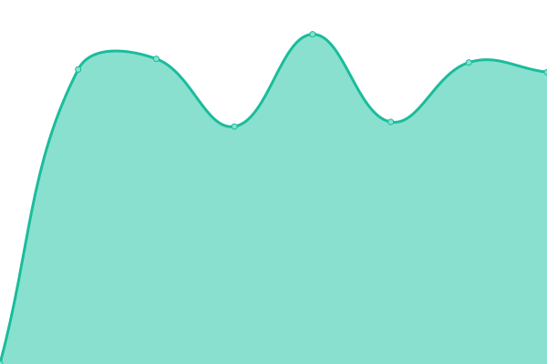

# [📈 Live Status](https://onedot-digital-crew.github.io): <!--live status--> **🟩 All systems operational**

This repository contains the open-source uptime monitor and status page for [Upptime](https://upptime.js.org), powered by [Upptime](https://github.com/upptime/upptime).

With [Upptime](https://upptime.js.org), you can get your own unlimited and free uptime monitor and status page, powered entirely by a GitHub repository. We use [Issues](https://github.com/upptime/upptime/issues) as incident reports, [Actions](https://github.com/onedot-digital-crew/upptime/actions) as uptime monitors, and [Pages](https://onedot-digital-crew.github.io) for the status page.

<!--start: status pages-->
<!-- This summary is generated by Upptime (https://github.com/upptime/upptime) -->
<!-- Do not edit this manually, your changes will be overwritten -->
<!-- prettier-ignore -->
| URL | Status | History | Response Time | Uptime |
| --- | ------ | ------- | ------------- | ------ |
|  [Greta Fenster](https://greta-fenster.com) | 🟩 Up | [greta-fenster.yml](https://github.com/onedot-digital-crew/upptime/commits/HEAD/history/greta-fenster.yml) | 

 915ms
     
 | 

<a href="https://uptime.one-dot.io/history/greta-fenster">100.00%</a>
    

|  [Salamander Proevolution](https://salamander-proevolution.com) | 🟩 Up | [salamander-proevolution.yml](https://github.com/onedot-digital-crew/upptime/commits/HEAD/history/salamander-proevolution.yml) | 

 889ms
     
 | 

<a href="https://uptime.one-dot.io/history/salamander-proevolution">100.00%</a>
    

<!--end: status pages-->

[**Visit our status website →**](https://onedot-digital-crew.github.io)

## 📄 License

- Powered by: [Upptime](https://github.com/upptime/upptime)
- Code: [MIT](./LICENSE) © [Upptime](https://upptime.js.org)
- Data in the `./history` directory: [Open Database License](https://opendatacommons.org/licenses/odbl/1-0/)
